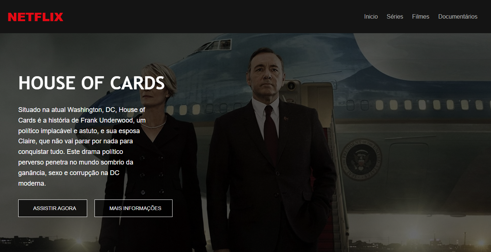
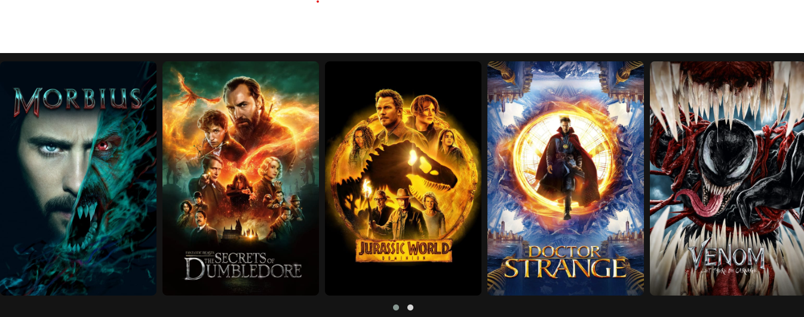

# 🎬 Netflix Clone

Este é um projeto de clone da interface da Netflix desenvolvido utilizando HTML, CSS e JavaScript. O objetivo é replicar a experiência visual da plataforma de streaming, com destaque para um filme principal e um carrossel de filmes.

## 🌟 Demonstração




## 🔥 Funcionalidades

- **Página inicial** com destaque para um filme principal.
- **Carrossel de filmes** com navegação interativa.
- **Design responsivo** que se adapta a diferentes tamanhos de tela.

## 🛠️ Tecnologias Utilizadas

- **HTML5**: Estrutura da página.
- **CSS3**: Estilização e layout.
- **JavaScript**: Configuração do carrossel e interações.
- **Owl Carousel**: Biblioteca para o carrossel de filmes.

## 🗂️ Estrutura do Projeto

```bash
.
├── img/
│   └── # Imagens do projeto (capas de filmes, ícones, etc.)
├── js/
│   ├── owl/
│   │   ├── jquery.min.js
│   │   ├── owl.carousel.min.js
│   │   └── setup.js
├── style/
│   ├── main.css
│   ├── responsive.css
│   ├── owl/
│   │   ├── owl.carousel.min.css
│   │   └── owl.theme.default.min.css
├── index.html
└── README.md
```

## 🚀 Como Executar o Projeto

1. Clone o repositório:

```bash
git clone https://github.com/joschonarth/netflix-clone.git
```

2. Navegue até o diretório do projeto:

```bash
cd netflix-clone
```

3. Abra o arquivo `index.html` no navegador.


## 📚 Bibliotecas e Dependências

* [Owl Carousel](https://owlcarousel2.github.io/OwlCarousel2/)


## 💡 Melhorias Futuras

* Implementação de uma API para carregar dinamicamente os filmes.
* Adição de sistema de autenticação e usuários.
* Criação de páginas para cada categoria de filmes e séries.


## 📞 Contato 

<div>
    <a href="https://www.linkedin.com/in/joschonarth/" target="_blank"></a>
    <a href="mailto:joschonarth@gmail.com" target="_blank"></a>
</div>